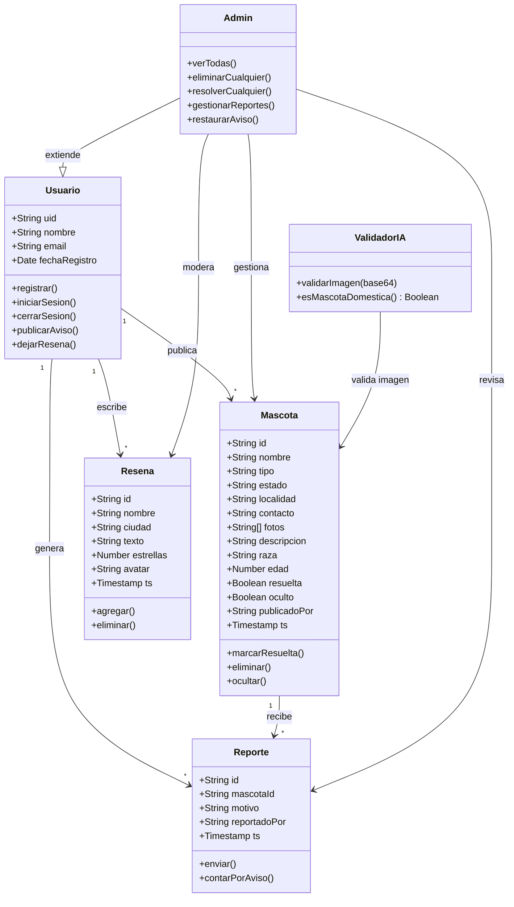

# 🐾 RADAR — Rastreo de Animales Desaparecidos con Alerta Regional

> Plataforma web gratuita para reportar y buscar mascotas perdidas en toda Argentina.

---

## 📋 Descripción

RADAR es una aplicación web que conecta a personas que perdieron su mascota con quienes la encontraron. Cualquier persona puede buscar avisos sin registrarse. Para publicar, contactar o dejar una reseña se requiere una cuenta gratuita.

Proyecto universitario desarrollado para la materia de Programación — UNAB 2026.

---

## ✨ Funcionalidades principales

- **Navegación pública** — buscá avisos sin necesidad de registrarte
- **Publicación de avisos** — subí una foto, descripción y contacto de tu mascota
- **Validación de imágenes con IA** — Claude API verifica que la foto sea de una mascota antes de publicarla
- **Buscador por localidad** — conectado a la API oficial de georef.datos.gob.ar con más de 5000 localidades
- **Mapa interactivo** — visualizá todos los avisos geolocalizados en el mapa de Argentina
- **Sistema de reportes** — los usuarios pueden reportar avisos inapropiados; a los 3 reportes se ocultan automáticamente
- **Panel de administración** — gestión completa de publicaciones, reseñas y reportes
- **Carrusel hero** — imágenes de fondo con transición automática
- **Diseño responsive** — optimizado para mobile y desktop

---

## 🛠️ Stack tecnológico

| Tecnología | Uso |
|---|---|
| HTML5 + CSS3 + JavaScript ES6+ | Frontend (single file) |
| Firebase Authentication | Registro e inicio de sesión |
| Firebase Firestore | Base de datos en tiempo real |
| Claude API (Anthropic) | Validación de imágenes con IA |
| Leaflet.js + OpenStreetMap | Mapa interactivo |
| API georef.datos.gob.ar | Autocompletado de localidades |
| GitHub Pages | Hosting |

---

## 📁 Estructura del repositorio

```
radar-mascotas/
├── index.html        # Aplicación completa
├── hero1.jpg         # Imágenes del carrusel hero
├── hero2.jpg
├── hero3.jpg
├── hero4.jpg
├── hero5.jpg
└── README.md
```

---

## 👥 Equipo

| Nombre | Rol |
|---|---|
| Lucas Vergara | Project Manager / Product Owner / Scrum Master |
| Jennifer Deger | Frontend Developer |
| Carla Brizuela | UX Designer |
| Agustín Benitez | QA Tester |

---

## 📐 Metodología

El proyecto fue desarrollado usando **SCRUM** con sprints de 2 semanas. El tablero de tareas se gestionó con **KANBAN** en GitHub Projects.

**Patrones de diseño aplicados:**
- **Singleton** — instancia única de Firebase (`initializeApp`)
- **Factory** — función `publicar()` encapsula la creación de objetos mascota
- **Strategy** — sistema de ordenamiento intercambiable (reciente, antiguo, nombre, resueltas)

---

## 📸 Capturas

| Hero | Cards | Mapa |
|---|---|---|
| Carrusel con fotos reales | Grilla con scroll reveal | Leaflet + OpenStreetMap |

---

## 📄 Licencia

Proyecto académico — UNAB 2026. Uso educativo.

---

<div align="center">
  Hecho con ❤️ · <strong>RADAR</strong> · Argentina 🇦🇷
</div>

---

## 📋 Requerimientos funcionales

| ID | Descripción | Prioridad |
|---|---|---|
| RF01 | El sistema permite registrarse con email y contraseña | Alta |
| RF02 | El sistema permite iniciar y cerrar sesión | Alta |
| RF03 | El usuario puede publicar un aviso con foto (validada por IA), descripción, localidad y contacto | Alta |
| RF04 | Cualquier visitante puede buscar avisos por localidad, tipo de animal y estado sin registrarse | Alta |
| RF05 | El usuario puede ver el detalle completo de cada aviso | Alta |
| RF06 | El usuario registrado puede contactar al dueño vía WhatsApp | Alta |
| RF07 | El usuario puede compartir un aviso en redes sociales | Media |
| RF08 | El usuario puede marcar su propio aviso como resuelto | Alta |
| RF09 | El usuario puede eliminar sus propios avisos | Alta |
| RF10 | El sistema valida con IA que la imagen subida sea de una mascota doméstica | Alta |
| RF11 | El usuario registrado puede reportar un aviso por motivo (falso, spam, inapropiado, otro) | Media |
| RF12 | El sistema oculta automáticamente los avisos que acumulan 3 o más reportes | Media |
| RF13 | El administrador puede gestionar todas las publicaciones, reseñas y reportes desde un panel | Alta |
| RF14 | El administrador puede restaurar avisos ocultos o eliminarlos definitivamente | Alta |
| RF15 | El usuario registrado puede dejar una reseña con puntuación y texto | Baja |
| RF16 | El mapa interactivo muestra todos los avisos activos geolocalizados | Media |
| RF17 | El buscador de localidades sugiere resultados en tiempo real desde la API oficial de Argentina | Media |

---

## 🔒 Requerimientos no funcionales

| ID | Descripción | Categoría |
|---|---|---|
| RNF01 | La interfaz es responsive y funciona correctamente en mobile y desktop | Usabilidad |
| RNF02 | La aplicación carga en menos de 3 segundos en condiciones normales de red | Rendimiento |
| RNF03 | Las imágenes se comprimen automáticamente a un máximo de 600px antes de almacenarse | Rendimiento |
| RNF04 | La autenticación de usuarios es gestionada por Firebase Auth con cifrado en el servidor | Seguridad |
| RNF05 | La contraseña de administrador se almacena como hash SHA-256, nunca en texto plano | Seguridad |
| RNF06 | Las reglas de Firestore controlan el acceso a los datos según el estado de autenticación | Seguridad |
| RNF07 | Los datos se sincronizan en tiempo real mediante Firestore `onSnapshot` | Confiabilidad |
| RNF08 | La aplicación está disponible 24/7 a través de GitHub Pages sin costo de servidor | Disponibilidad |
| RNF09 | El sistema acepta imágenes de hasta 5MB en formato JPG o PNG | Restricción |
| RNF10 | El sistema es compatible con Chrome, Firefox, Edge y Safari en sus versiones recientes | Compatibilidad |

---

## 📐 Diagrama de clases


